# 📊 Project Findings Summary

This report summarizes the key insights and business recommendations derived from three analytical dashboards:

- **Customer Summary** 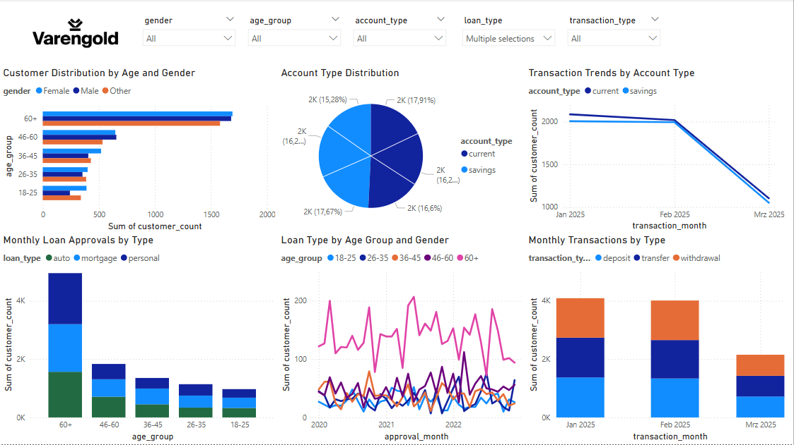
- **Loan Summary** 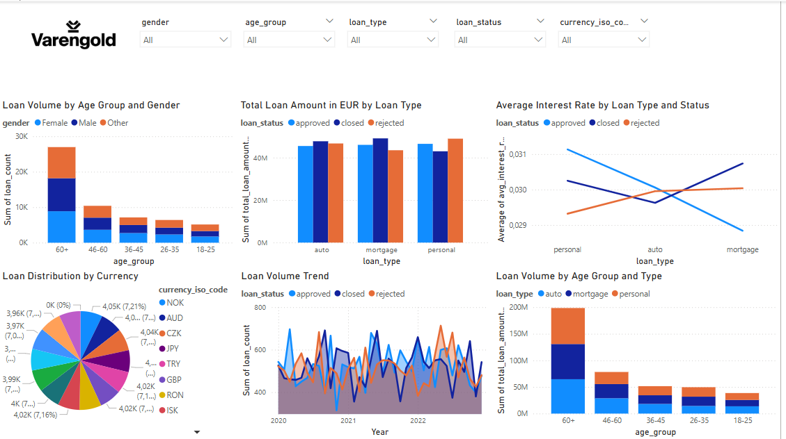
- **Transaction Summary** 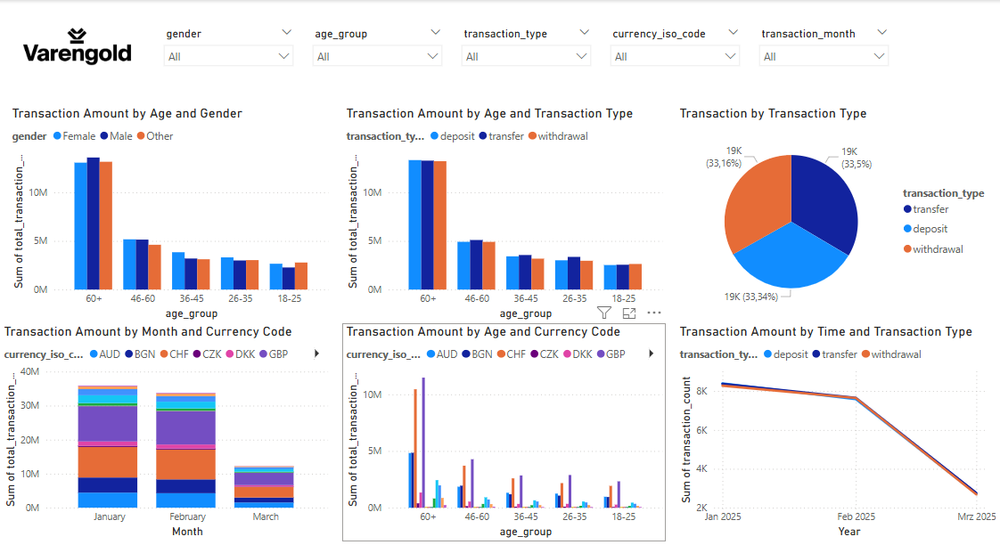

Each section includes visual references and actionable insights.

---

## 👥 1. Customer Summary

### 🔍 Key Insights

- **Transaction Trends**: January and February 2025 had the highest transaction volumes across deposits, transfers, and withdrawals.
- **Loan Demand by Age**: The 60+ age group dominates all loan types, especially auto and personal loans.
- **Account Preferences by Gender**:
  - Females slightly prefer savings accounts.
  - Males and others are more active in current accounts.
- **Top Customer Behavior**: 60+ males frequently use current accounts for withdrawals and deposits.

### 💡 Business Recommendations

- Launch a “Senior Financial Bundle” for the 60+ segment.
- Promote savings account benefits to female customers.
- Explore inclusive product design for non-binary customers.

### 📷 Example Visuals

- **Customer_Type**  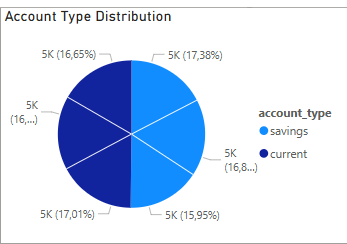
- **Customer_By_Age_And_Gender**  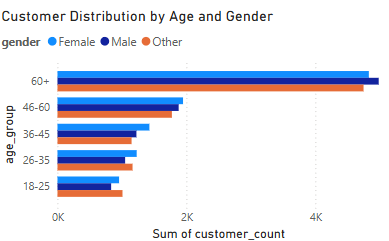

---

## 💰 2. Loan Summary

### 🔍 Key Insights

- **Total Loans**: Over 1,700 records with millions in total loan value.
- **Average Interest Rate**: ~3.3%
- **Loan Status**: Most loans are closed, followed by approved and rejected. 
- **Loan Type Distribution**: Personal > Mortgage > Auto
- **Age Group**: 60+ is the dominant loan segment.

### 💡 Business Recommendations

- Create a “Senior Loan Package” with flexible repayment and lower rates.
- Analyze rejected applications to improve approval rates.
- Offer tiered interest rates for personal loans.
- Focus marketing efforts in Q1 and Q2 based on approval trends.

### 📷 Example Visuals

- **Loan_By_Age_and_Type**  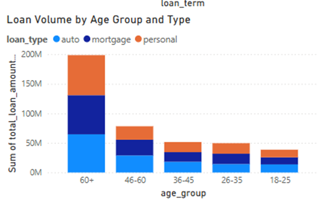
- **Total_Loan_By_Loan_Type**  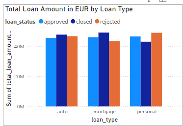
- **Average_Rate_By_Loan_Type_And_Status**  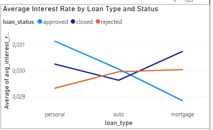
- **Loan_Trend**  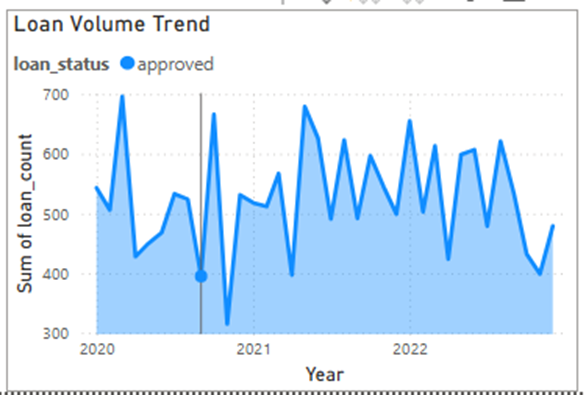

---

## 💳 3. Transaction Summary

### 🔍 Key Insights

- **Total Transactions**: 56,088
- **Total Value**: Over €81.9M
- **Average Transaction**: ~€43,338
- **Transaction Type**: Balanced across deposit, transfer, and withdrawal.
- **Age Group**: 60+ accounts for nearly 50% of volume and value.
- **Gender**: Fairly even distribution across Female, Male, and Other.
- **Currency**: GBP and CHF are the top currencies.
- **Monthly Trend**: Peak in January and February; drop in March.

### 💡 Business Recommendations

- Launch a “Senior Banking Program” with fee waivers and transfer perks.
- Develop cross-border products for GBP and CHF markets.
- Ensure inclusive design across all gender segments.
- Run seasonal campaigns in January–February and spring promotions in March.

### 📷 Example Visuals

- **Transaction_Amount_By_Age_and_Type**  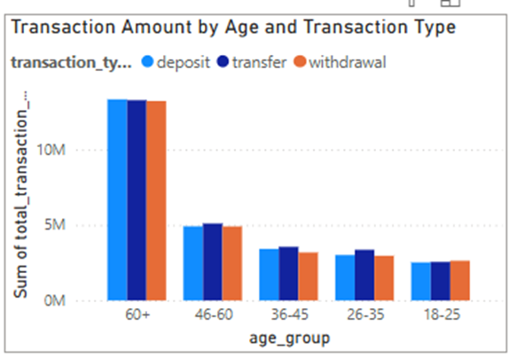
- **Transaction_Amount_By_Month_And_Currency**  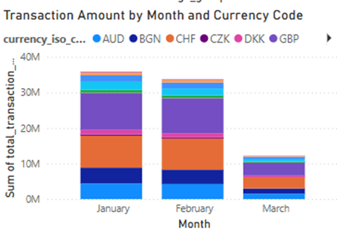
- **Transaction_Amount_By_Age_and_Gender**  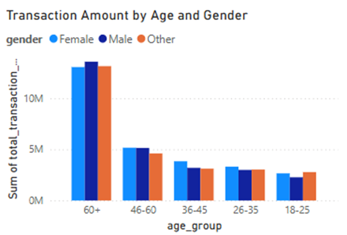
- **Transaction_Amount_By_Time_and_Type**  

# 📊 Branch Performance Summary

## 🔑 Key Insights

### 📌 Loan Activity (2020–2022)
- **Total Loan Amount (EUR)**: €137,975,798  
- **Total Loan Count**: 18,946  
- **Data Period**: January 2020 to December 2022  
- **Number of Branches**: 99  

### 📌 Transaction Activity (2025)
- **Total Transaction Amount (EUR)**: €81,909,127  
- **Total Transaction Count**: 56,088  
- **Data Period**: January 2025 to March 2025  
- **Number of Branches**: 99  

### 📌 Observations
- In just 3 months of 2025, transaction volume has already reached **59% of the total loan volume over 3 years**.
- All branches are represented in the transaction data, indicating full coverage.
- A significant portion of loans are associated with the `Other` gender and `60+` age group, which may warrant further risk or demographic analysis.

---

## 💡 Business Recommendations

1. **Enhance Transaction Forecasting Models**  
   Transaction activity is growing rapidly. Consider building monthly forecasting models to anticipate cash flow and customer engagement.

2. **Focus on High-Performing Branches**  
   Identify the top 10 branches by transaction volume and analyze their success factors to replicate best practices across the network.

3. **Segmented Marketing by Age and Gender**  
   Use `age_group` and `gender` to tailor financial products and campaigns to specific customer segments.

4. **Monitor High-Risk Demographics**  
   If the `Other` gender or `60+` age group dominates loan activity, conduct risk assessments and adjust credit policies accordingly.

### 📷 Example Visuals

- **Transaction_And_Loan**  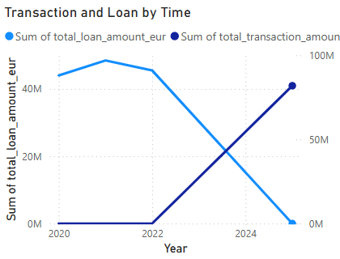
- **Transaction_And_Loan_By_Branch.png**  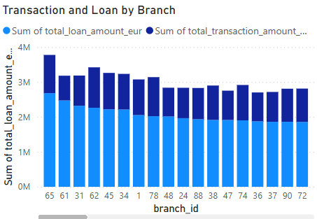
- **Loan_vs_Transaction_by_Age.png**  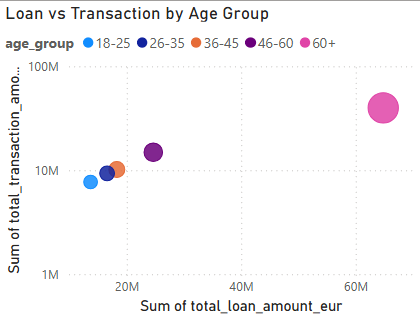

---

### dbt Documentation

The full dbt model documentation is available in the `target/` folder generated by `dbt docs generate`.

To view it locally:
1. Run `dbt docs serve`
2. Open http://localhost:8080 in your browser
